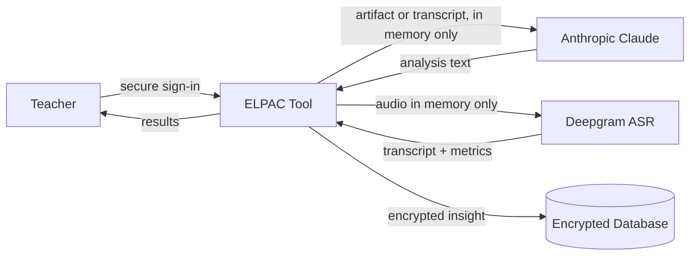

# ELPAC Teacher Analysis Tool — Data Flow & Security Overview

*A plain-language guide for school and district administrators.*

## What the tool is

The ELPAC Teacher Analysis Tool helps teachers understand English language development across all four ELPAC domains: Listening, Speaking, Reading, and Writing. Teachers submit evidence appropriate to each domain — written artifacts, audio recordings (Speaking), or structured listening observations — and the tool returns instructional estimates grounded in official ELPAC Range Performance Level Descriptors. **These are instructional estimates, not ELPAC scores.**

## How data flows through the system

1. **The teacher signs in.** Every page and every action requires an authenticated session, managed by Clerk. HTTPS is enforced in production.
2. **The teacher submits domain-appropriate evidence.**
   - **Writing / Reading:** photo or PDF of student work — processed in memory, sent to Claude, then discarded.
   - **Speaking:** audio recorded or uploaded in the browser — sent to Deepgram for transcription in memory, never stored. The teacher reviews and corrects the transcript before analysis. Deterministic fluency metrics accompany the transcript to Claude.
   - **Listening:** teacher completes a structured observation checklist; the proficiency level is derived deterministically from checked descriptors. Claude generates explanation and scaffolds only.
3. **Results are encrypted before storage.** Insight text uses AES-256-GCM with per-field IVs. Optional encrypted transcripts (Speaking) are stored separately with a retention window and independent purge path.
4. **Students are identified by system-generated UUIDs.** Teacher-chosen display labels are encrypted at rest.

## What we store — and what we don't

| We store | We never store |
| --- | --- |
| AI-generated analysis text (encrypted) | Student writing images/PDFs |
| Optional teacher-reviewed transcripts (encrypted, retention-bounded) | Raw audio recordings |
| Observation checklist JSON (Listening) | Voiceprints or biometric templates |
| Fluency metrics (derived numbers, JSONB) | Plaintext student labels |
| Roster entries, grade grants, audit log | Plaintext teacher emails (hashed only) |
| Teacher product feedback (category, message, page area, grade snapshot; not student data) | |

## Audio recording safeguards

- **District gate:** `audio_recording_enabled` must be true on the district record before any transcription.
- **Consent:** An active per-student consent record is required before transcription.
- **No audio persistence:** Audio exists only in memory for the duration of the request.
- **Transcript redaction in LangSmith:** Student speech text is excluded from observability traces; only metrics and metadata are logged.

## Third-party services

| Service | Role | What it receives |
| --- | --- | --- |
| **Clerk** | Teacher sign-in | Teacher credentials |
| **Anthropic (Claude)** | Analysis and scaffolds | Images or corrected transcripts (transient) |
| **Deepgram** | Speech-to-text (Speaking) | Audio buffer (transient, not retained by this app) |
| **LangSmith** (optional) | AI observability | Trace metadata; no images or transcript text |
| **Vercel / Railway** | Hosting | Encrypted database and application |

## A living document

Security is reviewed continuously as oral-domain support evolves. Questions from district partners are welcome.
