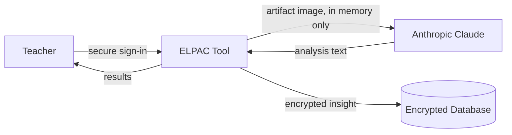

# ELPAC Writing Analysis Tool — Data Flow & Security Overview

*A plain-language guide for school and district administrators.*

## What the tool is

The ELPAC Writing Analysis Tool helps teachers understand the English language development of their students. A teacher photographs a piece of student writing, and the tool analyzes it against California's official ELPAC Writing Performance Level Descriptors. The teacher receives the student's strengths, an estimated proficiency level with reasoning, and concrete instructional scaffolds — in seconds instead of hours.

## How data flows through the system

1. **The teacher signs in.** Every page and every action requires an authenticated session, managed by Clerk, a dedicated identity provider. In production, all traffic must use HTTPS.
2. **The teacher uploads a photo or PDF of student writing.** The file is processed entirely in memory: it is prepared, sent to Anthropic's Claude model for analysis, and then discarded. **The image is never saved** — not in our database, not in file storage, nowhere.
3. **The analysis comes back and is encrypted before storage.** The AI-generated insight (strengths, estimated level, reasoning, scaffolds) is encrypted with AES-256-GCM before it is written to our PostgreSQL database. Someone with direct database access would see only ciphertext.
4. **Students are identified by system-generated IDs.** Each roster entry gets a random UUID. Teachers choose display labels for their students; labels are encrypted at rest the same way as insight text.

## What we store — and what we don't

| We store | We never store |
| --- | --- |
| AI-generated analysis text (encrypted at the field level) | Student writing artifacts (images or PDFs) |
| Roster entries: encrypted teacher-chosen labels, system-generated UUIDs, grade information | Plaintext student labels |
| A tamper-resistant audit log of actions taken | Plaintext teacher email addresses (only a SHA-256 hash) |
| Grade-grant records (admin-assigned or teacher-requested) | Plaintext IP addresses (only a SHA-256 hash in the audit log) |

## Safeguards in place

- **Authentication everywhere.** Every page and API endpoint requires a signed-in teacher; there are no anonymous entry points. HTTPS is enforced in production.
- **Grade-grant access control.** Teachers see and analyze students only when they hold an active, unexpired grade grant matching the student's school and grade (or a whole-school grant). Teachers submit access requests in-app; administrators approve or deny them. Grant creation and roster management require an administrator or ELD coordinator role. Every student read and analysis is recorded in the audit log with the grant that authorized it.
- **Encryption of sensitive content.** All AI-generated insight text and student roster labels are encrypted with AES-256-GCM (with a unique initialization vector per field) before storage, and the database connection itself uses TLS.
- **Hashing instead of storing identifiers.** Teacher emails and audit-log IP addresses are stored only as one-way SHA-256 hashes.
- **Tamper-resistant audit trail.** Every significant action — analyses, roster changes, saved insights, admin views, and cross-teacher reads — is recorded in an append-only audit log. Database permissions prevent the application itself from editing or deleting audit entries.
- **Least-privilege access.** The application connects to the database with a restricted role; schema changes require a separate, more privileged credential that the running app does not hold.
- **Input validation and limits.** All endpoints validate their inputs with strict schemas; uploads are limited to 4 MB and 5 pages per analysis.
- **Name-redaction instruction to the AI.** The analysis prompt explicitly instructs the model not to repeat any student name it sees in the artifact, so names in handwriting don't flow into stored results.

## Third-party services

| Service | Role | What it receives |
| --- | --- | --- |
| **Clerk** | Teacher sign-in and session management | Teacher account credentials |
| **Anthropic (Claude)** | AI analysis of student writing | The artifact image, transiently, for the duration of the analysis |
| **LangSmith** (optional) | Observability of AI calls, used to monitor quality | Trace metadata and prompt/analysis text; **never the artifact image itself** — image data is deliberately redacted from traces |
| **Vercel / Railway** | Application and database hosting | Standard hosting of the app and the encrypted database |

## A living document

Security is not a one-time checklist. We continuously review and strengthen these safeguards as the tool evolves, and we welcome questions from school and district partners about how student data is handled.
